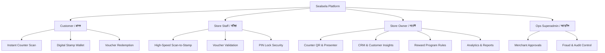
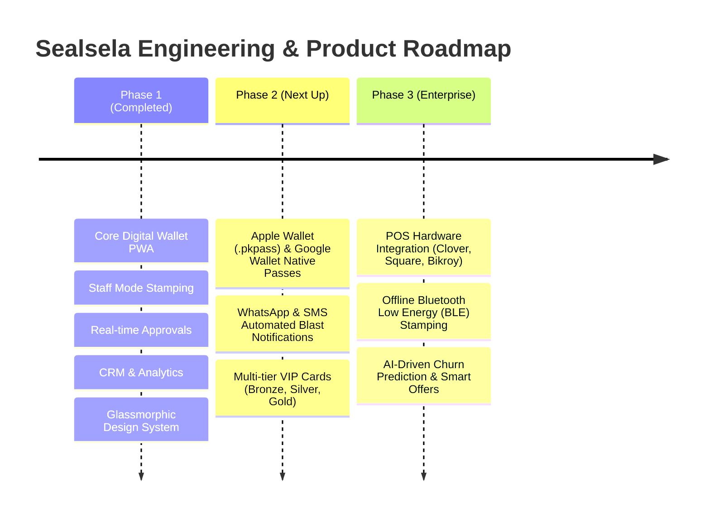

# Sealsela (সিলসিলা) — Product Requirement Document (PRD)
**Version:** 2.0  
**Status:** Active / Production-Ready  
**Target Audience:** Stakeholders, Product Managers, UI/UX Designers, Frontend/Backend Developers, and QA Engineers  
**Live Production URL:** [silsilaqr.vercel.app](https://silsilaqr.vercel.app)  

---

## 1. Executive Summary & Vision

### 1.1 Product Mission
**Sealsela (সিলসিলা)** — meaning *"chain of continuous connection"* — is a mobile-first, zero-friction digital loyalty and rewards platform engineered specifically for cafes, restaurants, salons, and retail merchants in Bangladesh and emerging markets.

### 1.2 Core Problem Statement
* **Paper Card Fatigue:** Traditional physical loyalty punch cards suffer from an 82% loss/forget rate, damage, and high printing costs.
* **Customer App Friction:** Customers abandon loyalty sign-ups when forced to download heavy native apps (100MB+) or complete lengthy account registrations while standing at a busy counter.
* **Merchant Blindness:** Offline merchants lack customer relationship management (CRM), retention metrics, repeat rate visibility, and automated marketing channels.
* **Staff Fraud:** Physical punch cards are easily forged, manually over-stamped, or passed between customers.

### 1.3 Value Proposition
1. **Zero-App Instant Web & PWA Experience:** Customers simply scan a counter QR code using any smartphone camera to instantly access their digital wallet card.
2. **Fraud-Resilient Staff Stamping:** Baristas and cashiers validate visits in seconds using high-speed Staff Mode with OTP/token validation, rate-limiting, and PIN-protected exit.
3. **Enterprise CRM & Real-Time Analytics:** Real-time customer tracking, visit frequency, repeat rates, privacy-masked contact lists, and CSV export.
4. **Luxury Emerald Glassmorphic Design:** A modern visual design language optimized for high-end cafes and restaurants.

---

## 2. User Roles & Personas



### 2.1 Customer (গ্রাহক)
* **Goal:** Collect digital stamps effortlessly when purchasing coffee/food and redeem free rewards without downloading a native app.
* **Key Scenarios:**
  * Scanning counter QR at checkout.
  * Viewing stamp progress (`0/5`, `3/5`) with coffee cup animations.
  * Claiming and presenting voucher QR codes to cashiers.

### 2.2 Store Staff / Cashier / Barista (কর্মী / বারিস্তা)
* **Goal:** Validate visits and issue stamps in < 3 seconds per customer during rush hours.
* **Key Scenarios:**
  * Scanning customer stamp approval requests with camera.
  * Manually entering 6-digit stamp codes.
  * Burning/redeeming reward vouchers safely without owner intervention.

### 2.3 Store Owner / Merchant Admin (দোকান মালিক / অ্যাডমিন)
* **Goal:** Configure loyalty rules, track daily customer footfall, monitor repeat rates, and export customer data for marketing.
* **Key Scenarios:**
  * Customizing stamp target (3, 5, 7, 8, 10) and reward text.
  * Presenting Fullscreen QR on phone screen to customers across the counter.
  * Viewing privacy-masked CRM and live analytics.

### 2.4 Platform Operations / Superadmin (সিলসিলা অপস)
* **Goal:** Manage merchant onboarding, review KYC approvals, and ensure fraud-free transactions across the ecosystem.

---

## 3. System Architecture & Technical Stack

```mermaid
graph LR
    subgraph Client Layer
        PWA[React 19 + Vite PWA]
        Tailwind[Tailwind CSS v4 + Glassmorphism]
    end

    subgraph Backend & Realtime
        Firestore[Cloud Firestore Realtime Sync]
        Auth[Firebase Phone / Token Auth]
        Storage[Cloud Storage Avatars & Covers]
        NodeAPI[Express.js / Vercel Serverless]
    end

    Client Layer -->|Real-time onSnapshot| Firestore
    Client Layer -->|REST APIs| NodeAPI
    Client Layer -->|Session State| Auth
    Client Layer -->|Assets| Storage
```

### 3.1 Stack Breakdown
* **Frontend Runtime:** React 19, TypeScript 5.7, Vite 8
* **Styling Framework:** Tailwind CSS v4 with `@tailwindcss/vite`, custom glassmorphic blur and emerald glow utilities
* **State Management:** React Context (`AuthContext`, `LanguageContext`) + Firestore real-time subscriptions (`onSnapshot`)
* **QR Engine:** Canvas-based client-side high-resolution rendering (`qrcode` library)
* **Hosting & CDN:** Vercel Edge Serverless Deployment with automatic CI/CD from GitHub `main` branch
* **Database & Auth:** Google Cloud Firestore (NoSQL), Firebase Authentication, Firebase Storage

---

## 4. Comprehensive Feature Specifications

### Module 1: Customer Digital Wallet & Home Experience

| Feature | Description | Acceptance Criteria |
| :--- | :--- | :--- |
| **Instant Slug Landing (`/:slug`)** | Dedicated web landing page for each merchant (e.g., `silsilaqr.vercel.app/cafeb`). | Shows store cover photo, floating logo, store name, category, and direct scan CTA without requiring prior sign-in. |
| **Mobile Wallet Home** | Customer's central wallet containing all earned merchant loyalty cards. | Multi-store horizontal card swipe, current stamp progress (`x/y`), reward unlock indicator, and luxury store cover headers. |
| **Stamp Cup Grid** | Visual interactive grid representing stamps collected in the current cycle. | Animated coffee cup icons filling with glowing emerald effects upon stamp addition; dynamic target sizing (3, 5, 7, 8, 10 cups). |
| **Voucher Redemption** | Digital voucher generation when target stamps are achieved. | Generates a single-use voucher QR code and 6-digit alphanumeric code; shows real-time countdown timer before expiry. |
| **Customer Profile** | Customer profile and account management. | Allows 1:1 image upload compressed via HTML5 canvas, phone number display, name editing, and bilingual Bangla/English toggle. |

---

### Module 2: Merchant Dashboard & Counter Operations

| Feature | Description | Acceptance Criteria |
| :--- | :--- | :--- |
| **Glassmorphic Fixed Header** | Sticky top navigation bar with luxury glassmorphic emerald design. | Stays fixed at the top across all tabs; includes store logo/name, language switch (`বাং`/`EN`), glowing Analytics toggle, Staff Mode lock, and Log Out. |
| **Counter QR Code** | High-definition counter QR code for customer scanning at cash counters. | Supports 1-click **HD PNG Download (1200px)** and 1-click **Copy Store Link**. |
| **Fullscreen Presenter Mode** | Tapping the QR thumbnail enlarges it to full screen. | High-contrast white QR card optimized for customer phone camera scans across the counter, complete with store branding and close button (`✕`). |
| **Live Stamp Approvals** | Real-time queue of customer check-in requests. | Automatically updates via Firestore `onSnapshot`; allows 1-tap **Approve** (awards stamp + plays audio chime) or **Reject**. |
| **Quick Voucher Burn** | Counter tool for validating and redeeming customer vouchers. | Validates single-use vouchers instantly in Firestore, prevents double redemption, and logs staff audit trail. |

---

### Module 3: Cashier Staff Mode (কাউন্টার কর্মী মোড)

| Feature | Description | Acceptance Criteria |
| :--- | :--- | :--- |
| **PIN-Locked Staff View** | Simplified counter interface optimized for speed and locked against admin tampering. | Hides analytics, CRM, and financial data; requires merchant owner 6-digit PIN to exit back to admin dashboard. |
| **Integrated Camera Scanner** | Camera-based barcode scanner for instant QR validation. | Automatically detects customer wallet codes, resolves customer identity, and awards stamps in < 1 second. |
| **Manual 6-Digit Code Fallback** | Fallback input for noisy lighting or cracked camera screens. | Allows typing 6-digit customer one-time code to grant stamps seamlessly. |
| **Double-Stamp Cool-off Protection** | Anti-fraud rule preventing accidental or fraudulent multi-stamping. | Locks duplicate stamp attempts for the same customer within 60 seconds unless explicitly authorized. |

---

### Module 4: Customer CRM & Retention Analytics

| Feature | Description | Acceptance Criteria |
| :--- | :--- | :--- |
| **Instant Client-Side Search** | Real-time search bar filtering across the entire merchant customer database. | Instant zero-latency fuzzy matching on customer names (Bengali/English), raw mobile digits, or masked strings. |
| **Privacy Phone Masking** | PDPA-compliant phone number obfuscation. | Displays customer numbers as `016 •••• 2043`, concealing sensitive middle digits while allowing staff verification. |
| **Customer Avatar Display** | Visual identity for frequent patrons. | Displays uploaded customer profile photos in CRM cards and audit trails; falls back to stylized initials monogram. |
| **Retention Funnel Statuses** | Automated customer segmentation tabs. | Categorizes patrons into **All**, **Active** (visited < 14 days), **Completed** (voucher earned), and **At Risk** (inactive > 14 days). |
| **PDPA CSV Export** | Export customer database to spreadsheet. | Generates UTF-8 BOM CSV containing names, masked/raw phones, visit counts, stamp totals, and last visit timestamps. |
| **Merchant Analytics Suite** | Visual charts and KPI metrics. | Tracks Today's Scans, Unique Customers, Repeat Visit Rate (%), Total Stamps Issued, and Hourly Footfall Distribution. |

---

### Module 5: Loyalty Rewards & Marketing Programs

| Feature | Description | Acceptance Criteria |
| :--- | :--- | :--- |
| **Modal Program Editor** | Focused floating dialog for editing loyalty program rules. | Opens in an overlay without page shifting; allows editing target stamps (`3`, `5`, `7`, `8`, `10`), validity days, and reward description with live preview. |
| **Modal Program Creator** | Floating dialog for launching new seasonal/specialty loyalty cards. | Creates structured reward programs with instant customer wallet synchronization. |
| **Custom Stamp Grid Variants** | Visual styling options for stamp icons. | Supports coffee cups (`☕`), stars (`⭐`), gift boxes (`🎁`), and retail tags. |

---

## 5. UI/UX Design System Guidelines

### 5.1 Color Tokens
| Token Name | Hex Code | Purpose |
| :--- | :--- | :--- |
| `Dark Forest Base` | `#071D13` | App root background and deep container base |
| `Glass Dark Emerald` | `rgba(9, 32, 21, 0.80)` | Sticky headers, navbars, and backdrop overlays |
| `Emerald Card Surface` | `#0E281C` | Primary cards, modals, and list items |
| `Emerald Brand Neon` | `#34D399` | Accent text, active state pills, primary highlights |
| `Emerald Primary Action` | `#10B981` | Primary CTA gradients and submit buttons |
| `Amber Gold Reward` | `#F59E0B` | Vouchers, completed stamp badges, staff mode pills |
| `Error Red` | `#EF4444` | Rejections, deletions, and lock indicators |

### 5.2 Glassmorphism & Blur Specifications
* **Backdrop Blur:** `backdrop-blur-2xl` (16px–24px blur filter)
* **Glass Border:** `border border-emerald-500/20` or `border border-white/10`
* **Box Shadows:** `shadow-2xl`, with ambient glow `glow-emerald` (`0 0 20px rgba(52, 211, 153, 0.25)`)

### 5.3 Responsive & Safe-Area Constraints
* All viewports adhere strictly to dynamic iOS and Android safe-area insets:
  * `paddingTop: max(10px, env(safe-area-inset-top, 10px))`
  * `paddingBottom: max(12px, env(safe-area-inset-bottom, 12px))`
* Container width is locked to `w-full max-w-md mx-auto` to ensure native PWA feel across all iPhone, Samsung, Xiaomi, and desktop devices.

---

## 6. Security, Anti-Fraud & Data Privacy

1. **Owner PIN Protection:**
   * Critical operations (exiting Staff Mode, resetting programs, exporting CRM) require the merchant owner's 6-digit PIN.
2. **Dynamic Stamp Verification Tokens:**
   * Customer QR codes regenerate dynamic time-based approval tokens (`token: Math.random().toString(36)...`) to prevent static barcode copying or screenshot reuse.
3. **Double-Scan Prevention:**
   * Staff stamping enforces a 60-second cool-down window per customer ID to prevent accidental double-tap stamp approvals.
4. **Data Minimization & Privacy:**
   * Customer phone numbers are masked by default across CRM views. Exporting raw data requires explicit consent acknowledgment.
5. **Role-Based Security Rules:**
   * Firestore security rules ensure merchants can only query cards and approvals belonging to their own `merchantId`.

---

## 7. Product Roadmap & Future Milestones



* **Phase 2:** Native Apple Wallet (`.pkpass`) & Google Wallet pass integration, automated WhatsApp stamp confirmations, and tiered loyalty levels.
* **Phase 3:** POS integration plugins, Bluetooth Low Energy (BLE) proximity stamping, and AI retention forecasting.

---

## 8. Document Sign-off & Version History

| Version | Date | Author / Team | Summary of Changes |
| :--- | :--- | :--- | :--- |
| **v1.0** | 2026-08-15 | Sealsela Core Product Team | Initial platform specification and prototype baseline. |
| **v1.5** | 2026-08-22 | Engineering & Design | Added Staff Mode, instant QR scanning, and multi-language support. |
| **v2.0** | 2026-08-26 | Product & Architecture | Fullscreen QR Presenter, modal-based program editor, instant CRM fuzzy search, privacy phone masking, and PWA viewport standardization. |
